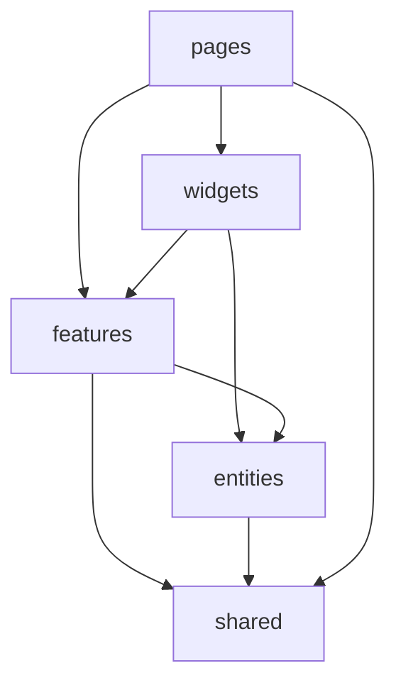

# Arquitetura — Frontend (Lista de Compras)

## Objetivo

Arquitetura **previsível, modular e repetitiva** — adequada a humanos e a IA. Inspirada em **Feature-Sliced Design** e separação “clean-ish”, sem pastas só por tipo técnico na raiz.

## Stack

Vue 3 · TypeScript · Vite · Pinia · Vue Router · VueUse · Tailwind CSS · Vitest · Playwright

## Estrutura de pastas (`frontend/src/`)

```
src/
├── app/           # Bootstrap: createApp, plugins, router, Pinia, estilos globais import
├── pages/         # Uma view por rota (compõe widgets/features); pouca lógica
├── widgets/       # Blocos de UI compostos (header da lista, layout de duas colunas)
├── features/      # Casos de uso (ex.: add-item, toggle-item, clear-completed)
├── entities/      # Item, User: tipos + UI mínima se necessário (cartão de item)
├── shared/        # Sem domínio: ui/, lib/, api/ (cliente HTTP genérico)
├── composables/   # useX — lógica reutilizável entre features
├── services/      # Camadas finas sobre API (itemsService, authService)
├── stores/        # Pinia: stores pequenas por domínio (auth, items)
├── types/         # Tipos globais compartilhados quando não couber em entities/
└── styles/        # globals.css, tokens CSS se necessário
```

### Responsabilidades

| Pasta | Conteúdo típico |
|-------|------------------|
| `app/` | `main.ts`, registro de plugins, providers globais |
| `pages/` | `LoginPage.vue`, `RegisterPage.vue`, `ListPage.vue` — roteamento de alto nível |
| `widgets/` | Combinações de features + entities (ex.: `ShoppingListBoard.vue`) |
| `features/` | Pasta por feature: UI + composable local opcional; importa `entities` e `shared` |
| `entities/` | Modelos e componentes “átomos” do domínio (`ItemRow.vue`) |
| `shared/` | Botões genéricos, formatação, `http` client, constantes |
| `composables/` | `useAuthRedirect`, `useItemFilters` |
| `services/` | Funções async que chamam API usando cliente de `shared/api` |
| `stores/` | Estado global necessário; evitar store “Deus” |
| `types/` | Tipos cruzando módulos |
| `styles/` | Tailwind `@tailwind` layers extras se preciso |

## Regra de dependência entre camadas

Uma camada **só importa de camadas abaixo** na hierarquia:

```
pages → widgets, features, entities, shared, composables, stores, services
widgets → features, entities, shared, composables, stores
features → entities, shared, composables, stores, services
entities → shared
shared → (nada do domínio da app)
```

`stores` e `services` são consumidos por `features`/`widgets`/`pages`; não importar `pages` de dentro de `entities`.



## Roteamento

- Rotas públicas: `/login`, `/cadastro`.
- Rota protegida: `/lista` — guard verifica autenticação (token/sessão conforme implementação).
- Lazy load de `pages/` quando o bundle crescer.

## Estado

- **Pinia** para sessão de usuário e lista de itens quando precisar compartilhar entre widgets.
- Estado local em componentes quando só uma subtree precisa.
- **VueUse** para debounce, preferências de browser, etc.

## O que evitar

- **Vuex** — usar Pinia.
- **Mixins** — usar composables.
- Pastas genéricas na raiz tipo `components/` + `views/` sem agrupamento por domínio.
- Lógica de negócio extensa no `<template>`.

## TDD

- Testes de unidade/componente perto do código (`__tests__` ou `*.spec.ts` conforme padrão do repo).
- E2E Playwright para fluxos críticos (login, adicionar item, marcar comprado).

## Backend

**API Go ainda não existe.** Integração futura via `services/` + variáveis de ambiente (`VITE_API_BASE_URL`). Até lá: mocks; ver [`API_RULES.md`](API_RULES.md).
